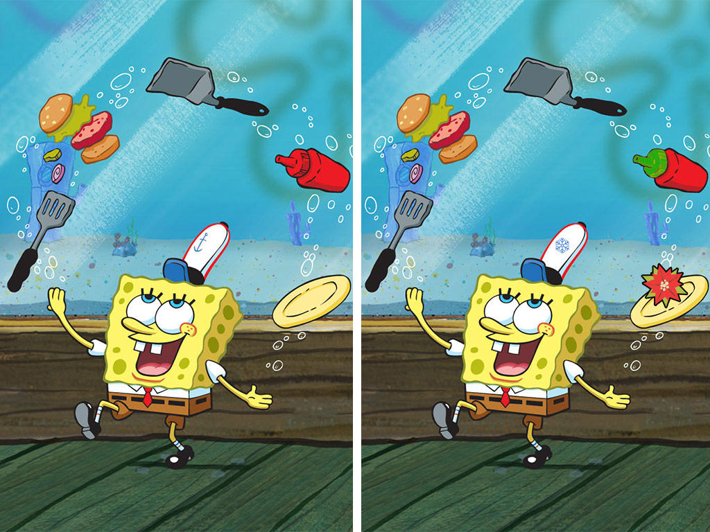
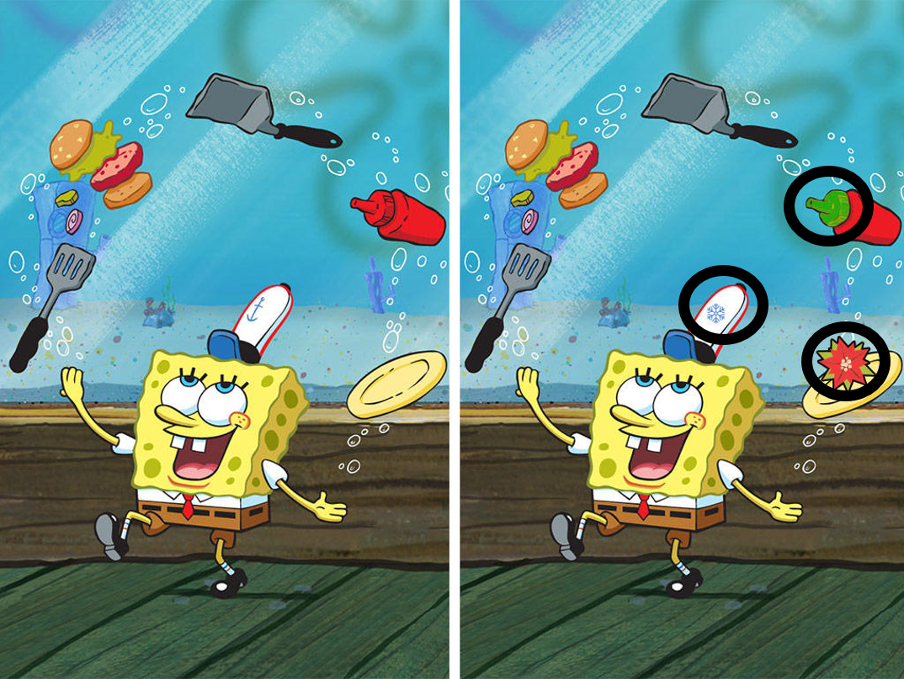
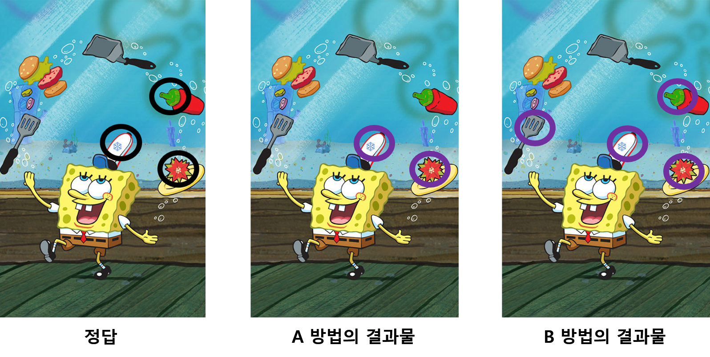

# Precision-and-Recall

본 게시글은 인식, 분류, 검출, 검색 등의 작업 성능 평가시 활용되는 척도인 **Precision(정밀도)** 과 **Recall(재현율)** 에 대한 이해를 돕고자 작성되었습니다.

우선 **Precision** 과 **Recall** 을 설명하기에 앞서 우리가 해결해야할 문제를 정의하고 문제를 해결하기 위한 방법에 대한 성능 평가 척도로 **Precision** 과 **Recall** 을 활용하여 설명을 드리겠습니다.

## 문제: 틀린 그림 찾기

우리가 해결해야할 문제를 **틀린 그림 찾기** 라고 정의하도록 하겠습니다.

**틀린 그림 찾기** 란 2 개의 유사한 그림을 비교해서 서로 다른 부분을 찾는 문제입니다.

(심심하시면 한 번 틀린 부분을 찾아보시길 바랍니다. 정답은 아래에 있습니다.)

정답은 총 3 개 (소스, 모자, 접시)로 우측 그림에서 검은색 원으로 강조된 부분입니다.

이제 우리가 **틀린 그림 찾기** 문제에 대한 해결 방법으로 A 방법과 B 방법을 개발했다고 가정하겠습니다.

아래의 그림은 A 방법 및 B 방법을 이용했을 때의 결과를 정답과 비교한 그림입니다. 

보라색 원으로 강조된 부분은 각 방법이 서로 다른 부분(정답)이라고 판단하여 찾아낸 부분입니다.

결과를 비교해보면 A 방법은 모자와 접시는 잘 찾아냈지만 소스는 찾아내지 못했습니다. 

그리고 B 방법은 모자, 접시, 소스를 잘 찾아냈지만 뒤집개와 햄버거 부분을 서로 다른 부분으로 잘못 판단하였습니다.

그렇다면 실제로 변한 부분을 모두 못찾았지만 변하지 않은 부분은 제대로 판단한 A 방법과 

실제로 변한 부분은 모두 찾아냈지만 변하지 않은 부분을 제대로 판단하지 못한 B 방법 중 

어느 방법이 더 좋다고 판단할 수 있을까요?

이에 대한 성능 평가를 위해 **Precision** 과 **Recall** 이라는 척도가 활용됩니다.

우선 Precision 과 Recall 의 측정방식에 대해 설명드리고 비교를 통해 둘 의 차이점을 설명드리도록 하겠습니다.

## Precision

Precision 은 각 방법이 서로 다른 부분이라고 판단한 부분들 중에서 실제로 변한 부분(정답)의 비율을 의미합니다.

따라서,

A 는 2 개의 서로 다른 부분을 판단했고 그 중 정답은 2개 이니 Precision 은 2/2 = 1.0 으로 100% 입니다. 

B 는 5 개의 서로 다른 부분을 판단했고 그 중 정답은 3개 이니 Precision 은 3/5 = 0.75 로 75% 입니다.

## Recall

Recall 은 실제로 변한 부분들(정답: 소스, 모자, 접시) 중에서 각 방법이 몇 개의 정답을 맞추었는지에 대한 비율을 의미합니다.

따라서, 정답이 3개 일 때,

A 는 2 개의 서로 다른 부분을 판단했고 그 중 정답은 2개 이니 Recall 은 2/3 = 0.67 으로 67% 입니다. 

B 는 5 개의 서로 다른 부분을 판단했고 그 중 정답은 3개 이니 Precision 은 3/3 = 1.00 로 100% 입니다.

##  요약

**Precision** 을 측정했을때는 A 가 더 좋은 방법이라고 생각될 수 있으나, **Recall** 을 측정했을때는 B 가 더 좋은 방법이라고 생각될 수 있습니다.

그렇다면 **Precision** 이 높다는 의미와 **Recall** 이 높다는 의미는 무슨 차이가 있을까요?

